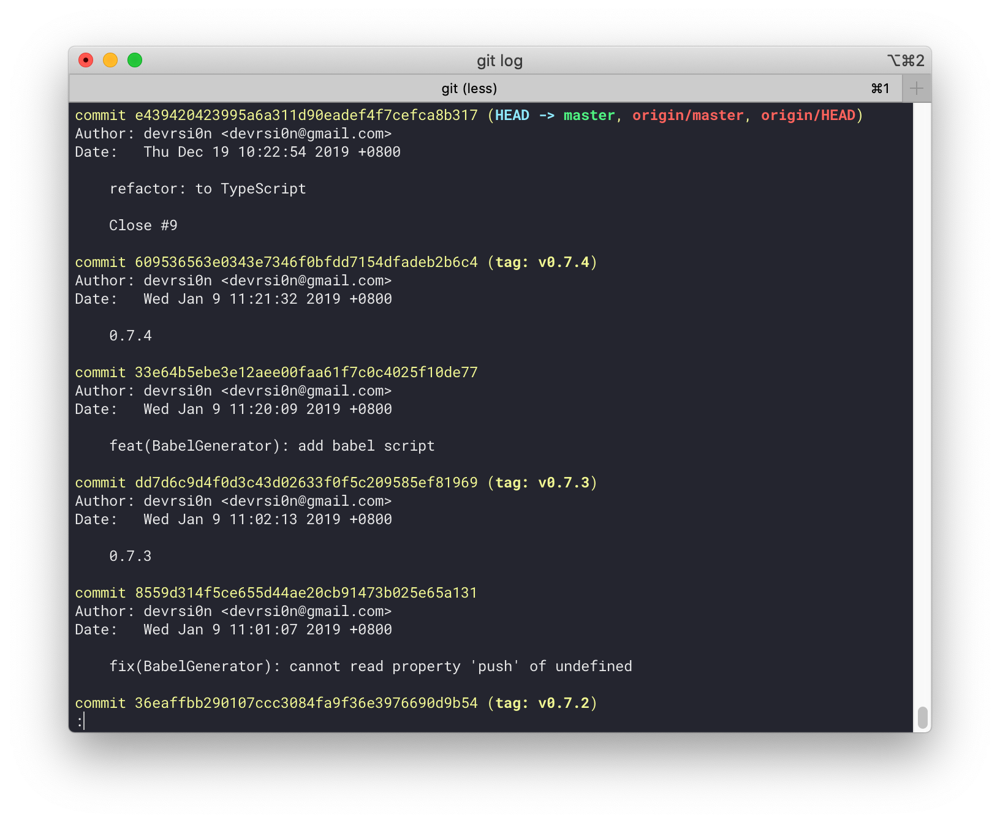
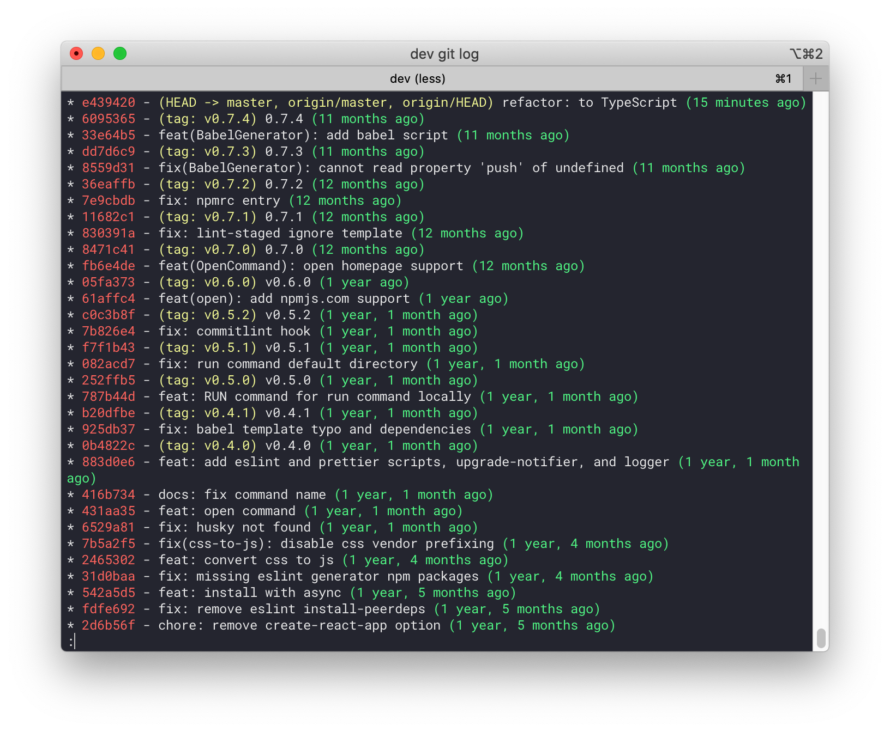

# dev-command

A modern, flexible command tool for JavaScript developers.

[](https://npmjs.org/package/dev-command)
[](https://circleci.com/gh/devrsi0n/dev-command/tree/master)
[](https://github.com/devrsi0n/dev-command/blob/master/package.json)

## Install

```sh
npm i -g dev-command
# or
yarn global add dev-command
```

## Usage

### init

The `init` command will generate flexible config files or scripts and install all npm dependencies silently.

It's so simple to add good linter for your exists project.

```sh
dev init

? Boilerplate type (Use arrow keys)
❯ ESLint
  prettier
  commitlint
  babel
  editorconfig
  license
  gitignore
```

### open

Open git repo or package.json repo URL with default browser in current working directory.

```sh
dev open
```

### git

```sh
dev git log
```

Turn ugly `git log` into pretty graph.

<div align="left">
  
  
</div>

### css-to-js

Convert `src/**/*.css` file to `src/**/*.css.js`

`src`(Directory) is optional, using cwd if not exist

```sh
dev css-to-js src
```
